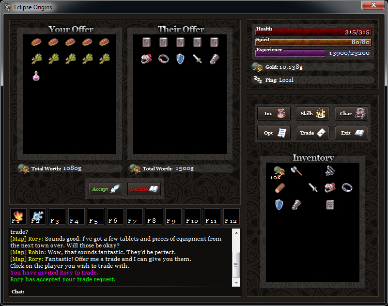



## Eclipse Origins v2 Free MMORPG Maker

### Description

<b>Purpose:</b> Open-source game engine used to create your very own MMORPG!

  

<b>Provided:</b> Fantastic base with everything you need for making an MMORPG! There's even a huge community based solely around using this software which is filled with documentation, tutorials and resources. Please keep in mind that the provided source code requires your average VB6 runtime files installed as well as the VB6 DX7 library. These can be found as a separate download on the website.

  

<b>Support:</b> I'll offer what support I can on this site, but for tutorials and resources please visit the website.

  

<b>Website:</b> <a href="http://www.freemmorpgmaker.com">Free MMORPG Maker</a>
 
### More Info
 

             |
---                |---
**Submitted On**   |2011-02-15 08:00:16
**By**             |[Robin Perris](https://github.com/Planet-Source-Code/PSCIndex/blob/master/ByAuthor/robin-perris.md)
**Level**          |Advanced
**User Rating**    |3.8 (15 globes from 4 users)
**Compatibility**  |VB 6\.0
**Category**       |[Games](https://github.com/Planet-Source-Code/PSCIndex/blob/master/ByCategory/games__1-38.md)
**World**          |[Visual Basic](https://github.com/Planet-Source-Code/PSCIndex/blob/master/ByWorld/visual-basic.md)
**Archive File**   |[Eclipse\_Or2198202162011\.zip](https://github.com/Planet-Source-Code/robin-perris-eclipse-origins-v2-free-mmorpg-maker__1-73749/archive/master.zip)

